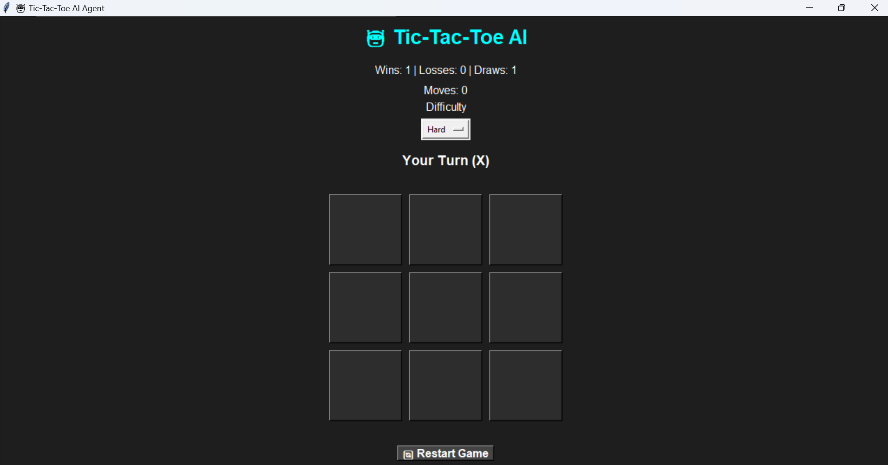
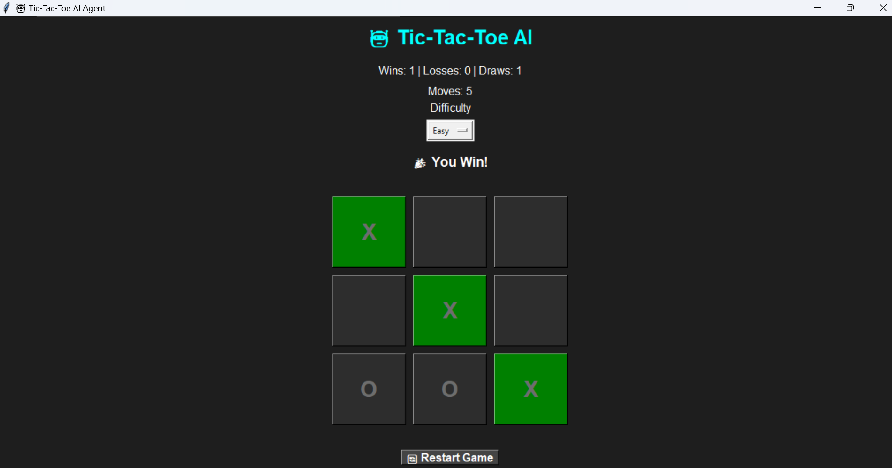
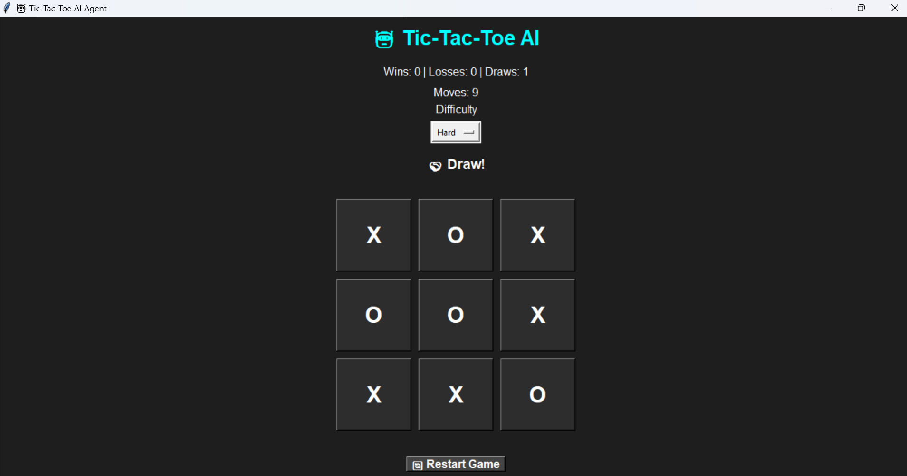

# Task 2 - Tic Tac Toe AI

An AI-powered Tic-Tac-Toe game using the Minimax Algorithm and Alpha-Beta Pruning.
## AI Algorithm

This project uses the Minimax Algorithm with Alpha-Beta Pruning.

### Minimax
The AI evaluates all possible future game states and chooses the move with the highest score.

### Alpha-Beta Pruning
Alpha-Beta Pruning reduces the number of nodes explored by eliminating branches that cannot affect the final decision, improving efficiency without changing the outcome.

## Features
- Human vs AI
- Minimax Algorithm
- Alpha-Beta Pruning
- Difficulty Levels
- Score Tracking
- Move Counter
- Dark Theme
- Winning Line Highlight

## Technologies
- Python
- Tkinter

## How to Run


## Screenshots

### 🎮 Game Start Screen

The initial game board with dark-themed interface, scoreboard, move counter, and difficulty selection.



---

### 🎉 Player Victory

The human player wins against the AI. The winning combination is highlighted in green.



---

### 🤝 Draw Match

A complete game resulting in a draw, demonstrating the AI's strategic gameplay.


```bash
python main.py
